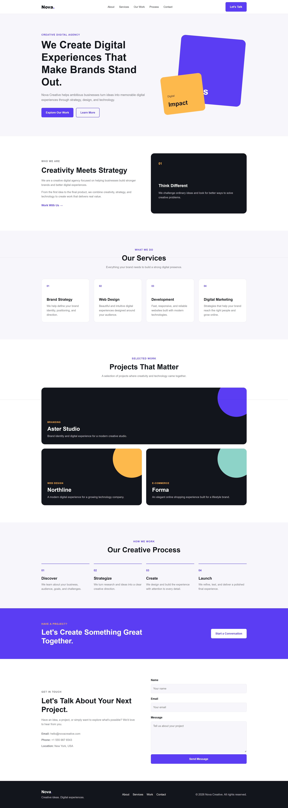
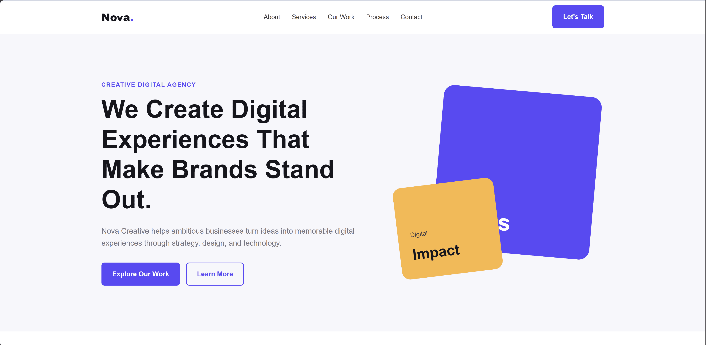

# Nova Creative Landing Page — Laravel

A responsive creative agency landing page built with Laravel, Blade, HTML, and CSS as part of my practical full-stack learning journey.

## Preview

### Full Page



### Hero Section



## About the Project

Nova Creative is a fictional creative digital agency landing page designed to practice building a complete responsive website with Laravel.

The project focuses on creating a polished frontend while using Laravel to handle the application structure and page routing.

This is the Laravel version of the Nova Creative landing page. I am also building the same project with Express.js to better understand how different backend frameworks approach a similar web application.

## Features

- Responsive landing page
- Hero section
- About section
- Services section
- Selected work section
- Creative process section
- Call-to-action section
- Contact section
- Footer
- Responsive navigation
- Mobile, tablet, and desktop layouts
- Custom favicon
- Semantic HTML structure
- Custom CSS styling

## Tech Stack

- Laravel
- PHP
- Blade
- HTML5
- CSS3

No frontend frameworks such as Bootstrap or Tailwind CSS are used.

## Project Structure

```text
Nova-Creative-Landing-Page-Laravel/
├── app/
│   └── Http/
│       └── Controllers/
│           └── PageController.php
├── public/
│   ├── css/
│   │   └── style.css
│   └── images/
│       └── favicon.png
├── resources/
│   └── views/
│       └── home.blade.php
├── routes/
│   └── web.php
├── screenshots/
│   ├── full-page.jpeg
│   └── hero-section.png
├── LICENSE
└── README.md
```

## Getting Started

Clone the repository:

```bash
git clone https://github.com/Samiullah-Popalzai/Nova-Creative-Landing-Page-Laravel.git
```

Go into the project directory:

```bash
cd Nova-Creative-Landing-Page-Laravel
```

Install PHP dependencies:

```bash
composer install
```

Create the environment file:

```bash
cp .env.example .env
```

Generate the application key:

```bash
php artisan key:generate
```

Start the Laravel development server:

```bash
php artisan serve
```

Then open:

```text
http://127.0.0.1:8000
```

## Learning Goals

This project is part of my ongoing practice in full-stack web development.

The main goals are:

- Practice Laravel project structure
- Work with Laravel routes
- Create and use controllers
- Render Blade views
- Serve CSS and other public assets
- Build responsive layouts with HTML and CSS
- Practice semantic HTML
- Improve frontend structure and styling
- Understand how Laravel handles a simple web page

## Related Project

The same landing page is also implemented using Express.js.

**Express.js version:**

https://github.com/Samiullah-Popalzai/Nova-Creative-Landing-Page-Express.js

Building the same project in both Laravel and Express.js helps me compare their approaches while keeping the frontend concept similar.

## Author

**Samiullah Popalzai**

Full Stack Engineer & WordPress Developer
Kabul, Afghanistan

GitHub:
https://github.com/Samiullah-Popalzai

LinkedIn:
https://linkedin.com/in/samiullah-popalzai/

Portfolio:
https://samiullah-popalzai.github.io

## License

Copyright © 2026 Samiullah Popalzai.

All rights reserved.

This repository is publicly available for viewing and educational or evaluation purposes, including portfolio and job application review.

The code may not be copied, modified, distributed, published, sublicensed, sold, or reused in other projects without prior written permission from the copyright holder.
